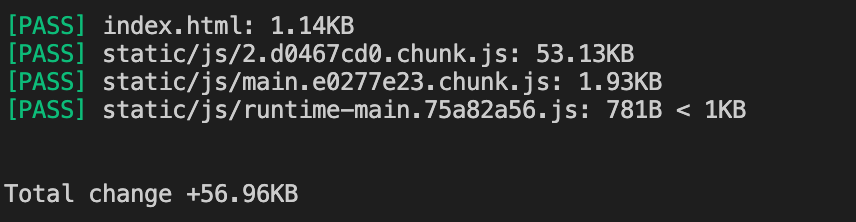
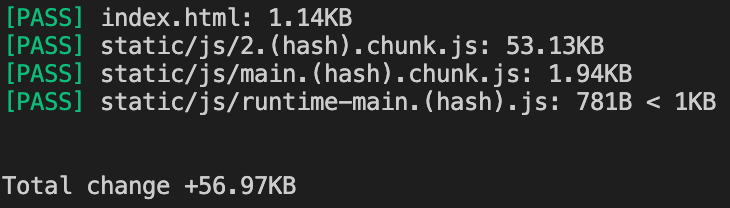
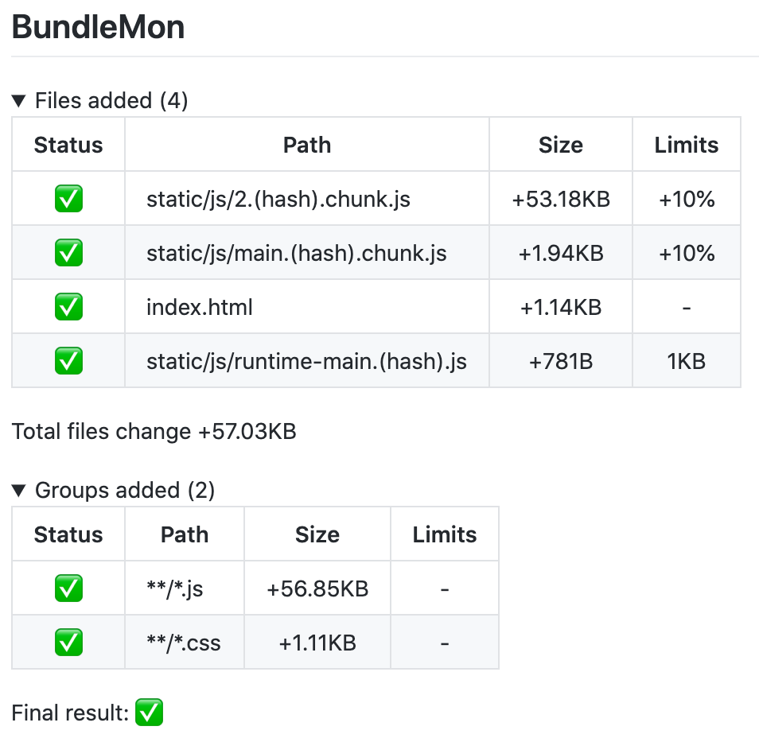
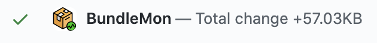

This step by step guide will help you set up [BundleMon](https://github.com/LironEr/bundlemon) with CodeFresh

### Clone repo

For this guide I used this repo: https://github.com/Yog9/SnapShot

```
git clone https://github.com/Yog9/SnapShot
```

### Build

```
yarn build
```

### Add BundleMon

```
yarn add -D bundlemon@next
```

### Add BundleMon config

Create a file new file `.bundlemonrc.json`

```json
{
  "baseDir": "./build",
  "files": [
    {
      "path": "index.html"
    },
    {
      "path": "static/js/*.chunk.js",
      "maxPercentIncrease": 10
    },
    {
      "path": "static/js/runtime-main.*.js",
      "maxSize": "1kb"
    }
  ]
}
```

### Run BundleMon

```
yarn bundlemon
```



### Ignore hash in file name

Changing app code will cause webpack to generate a new hash for files that have been changed.

```
main.e0277e23.chunk.js -> main.c2a935b4.chunk.js
```

In order for BundleMon to know it's the same file you need to add `<hash>` string to file path config:

```json
{
  "baseDir": "./build",
  "files": [
    {
      "path": "index.html"
    },
    {
      "path": "static/js/*.<hash>.chunk.js",
      "maxPercentIncrease": 10
    },
    {
      "path": "static/js/runtime-main.<hash>.js",
      "maxSize": "1kb"
    }
  ]
}
```



### Create pipeline

- Create new pipeline in CodeFresh
- Add GIT triggers:
  - PR trigger:
    - trigger name: `PR`
    - trigger by: `Pull request opened` & `Pull request synchronized`
  - main branch trigger:
    - trigger name: `main-push`
    - trigger by: `Push commits`
    - branch: `/^((main)$).*/gi`

```yaml
version: "1.0"

steps:
  main_clone:
    title: "Cloning repository"
    type: "git-clone"
    repo: "${{CF_REPO_OWNER}}/${{CF_REPO_NAME}}"
    revision: "${{CF_REVISION}}"
    git: "github"

  install:
    title: "Install dependencies"
    image: "node:14"
    environment:
      - NPM_CONFIG_CACHE=${{CF_VOLUME_PATH}}/.cache/npm
      - YARN_CACHE_FOLDER=${{CF_VOLUME_PATH}}/.cache/yarn
    commands:
      - yarn

  build:
    title: "Build"
    image: "node:14"
    commands:
      - yarn build

  bundlemon:
    title: "Run BundleMon"
    image: "node:14"
    environment:
      - BUNDLEMON_PROJECT_ID=${{BUNDLEMON_PROJECT_ID}}
      - BUNDLEMON_PROJECT_APIKEY=${{BUNDLEMON_PROJECT_APIKEY}}
    commands:
      - yarn bundlemon

  deploy:
    title: "Deploy"
    image: "node:14"
    commands:
      - echo "deploy..."
    when:
      branch:
        only:
          - main
```

### Create BundleMon project

In order to save history and get differences from your main branches you will need to create a new project and setup environment variables.

- [Create new project](https://app.bundlemon.dev/create-project) and copy the project ID and API key
- Add `BUNDLEMON_PROJECT_ID` & `BUNDLEMON_PROJECT_APIKEY` to pipeline variables

> API key is a secret, encrypt the secret in CodeFresh UI when adding this variable

### Add GitHub integration

- [Install BundleMon GitHub App](https://github.com/apps/bundlemon)

- Add output configuration to BundleMon config

```json
"reportOutput": [
  [
    "github",
    {
      "checkRun": false,
      "commitStatus": true,
      "prComment": true
    }
  ]
],
```

> You can change github output options

When creating your [first PR](https://github.com/LironEr/bundlemon-codefresh-example/pull/1) with BundleMon you should see all files found by BundleMon as "Added", because there isn't a record on your main branch.


<br />


Once you merge the PR BundleMon will keep a record on your main branch, so on your next PR you should see the difference between the PR and your main branch.
